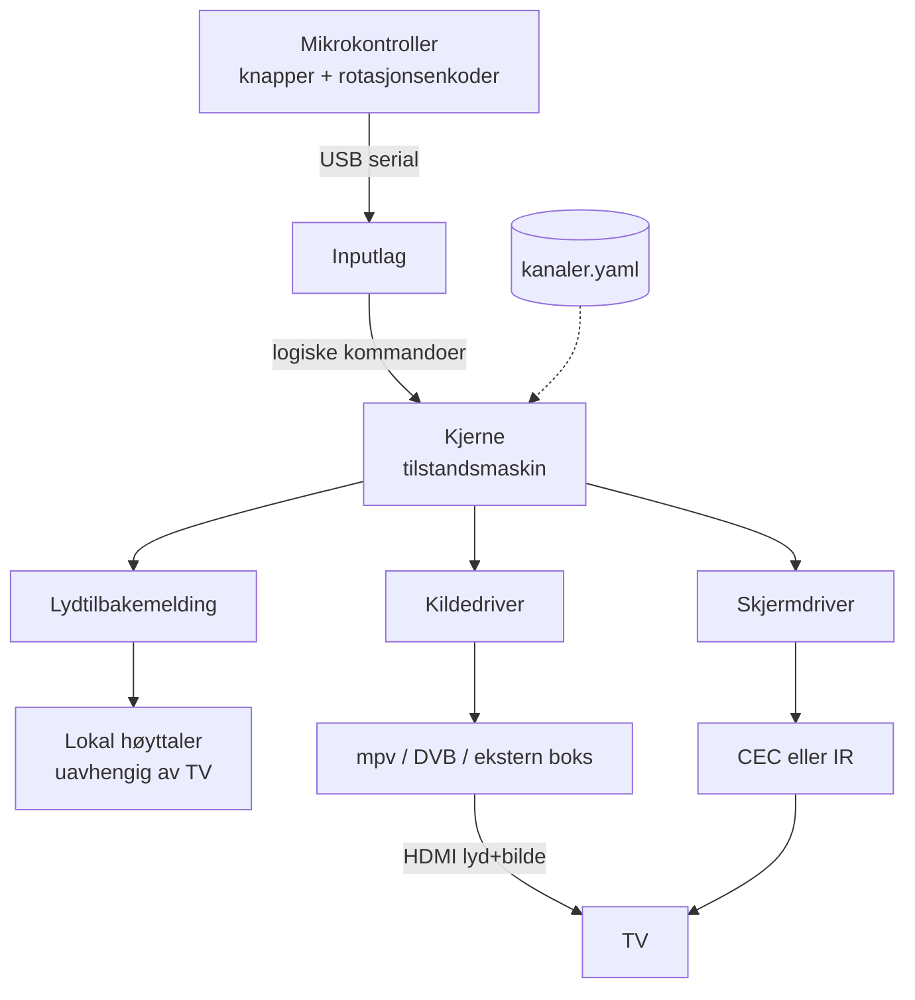

# Arkitektur og løsningsmodell — diskusjonsgrunnlag

Dette dokumentet er ikke en beslutning. Det er et forsøk på å skille de valgene
som låser arkitekturen fra de som kan tas senere, slik at vi diskuterer de
riktige tingene først.

Utgangspunktet er prosjektforslaget i `README.md`. Der hvor jeg mener forslaget
tar en forutsetning som bør utfordres, sier jeg det eksplisitt under
**Innvending**.

> **Status:** valget har falt på **modell C med en Google TV-enhet** som
> innholdsleverandør. Se [google-tv-styring.md](google-tv-styring.md) for
> styringsflaten i detalj. Det valget forenkler flere av seksjonene under
> vesentlig — hvis alle kanalene delegeres, blir Pi-en en hodeløs
> nettverkskontroller, og §2 (DRM og tokens), §4 (mpv/Kodi), §7 (CEC fra
> Pi-en) og kiosk-modus faller i praksis bort. Seksjonene er beholdt fordi
> avveiingene de beskriver fortsatt er de som begrunner valget.

---

## 0. De seks beslutningene som blokkerer alt annet

Alt i resten av dokumentet henger på disse. De øvrige valgene (Python-struktur,
knappedesign, systemd-oppsett) er sammenlignbart billige å endre senere.

| # | Beslutning | Hvorfor den er først | Foreslått svar |
|---|---|---|---|
| 1 | **Hvilke kanaler/tjenester skal faktisk støttes?** | Avgjør om DRM er i bildet, og dermed hele løsningsmodellen | Må besvares av deg — se §1 |
| 2 | **Er boksen selv spilleren, eller styrer den en annen spiller?** | Avgjør om Pi-en er en mediemaskin eller en orkestrator | Bygg *sømmen* nå, utsett valget — se §3 |
| 3 | **Fungerer CEC på den konkrete TV-en?** | Hvis nei, faller av/på og kildevalg — bærende antakelser | Verifiseres i uke 1 — se §7 |
| 4 | **Hvor kommer lydtilbakemeldingen ut?** | Hvis den går via HDMI, er boksen stum akkurat når brukeren trenger den mest | Egen høyttaler på boksen — se §6 |
| 5 | **Skal pårørende kunne feilsøke uten husbesøk?** | Påvirker nettverk, konfigmodell og logging fra dag én | Ja, bygg det inn nå — se §10 |
| 6 | **Hvem eier påloggingstokenene — vi eller en app?** | Avgjør vedlikeholdsbyrden over år, ikke bare oppsettet | Avgjøres av Widevine-spiken — se §2 |

---

## 1. Den avgjørende aksen: innholdstilgang og DRM

README-en behandler «Kodi vs. egne skript» som et åpent valg i
implementasjonen. Jeg mener det er feil innramming. Det er ikke et valg om
programvare — det er et valg om **hvilke tjenester som i det hele tatt er
teknisk og lisensmessig tilgjengelige for en Linux-maskin på ARM**.

Grovt sett faller innhold i to bøtter:

**Bøtte A — åpne strømmer.** Direkte HLS/DASH uten DRM. Her ligger typisk
NRKs lineære kanaler, radio, DVB-T/T2 via egen tuner, og IPTV-abonnement.
Dette spiller Pi-en helt fint selv, med full kontroll og null overraskelser.

**Bøtte B — DRM-beskyttede tjenester.** TV 2 Play, Netflix, HBO Max, Disney+,
Viaplay. Disse krever Widevine. På ARM-Linux betyr det i praksis Widevine L3 i
Chromium, som gir lav oppløsning, er avhengig av at nettleseren fortsetter å
levere CDM-en, og som typisk ligger utenfor tjenestenes egne vilkår siden
plattformen ikke er en støttet klient. Det er ikke et fundament å bygge en boks
noen skal *stole på* oppå: det som knekker er ikke koden vår, men en
oppdatering hos tredjepart, uten forvarsel, hjemme hos en bruker som ikke kan
feilsøke.

Den lisensierte veien til bøtte B er å la en sertifisert enhet spille
innholdet — en Android TV/Google TV-boks eller Apple TV — og la vår boks
*styre* den.

> **Spørsmål 1 til deg:** Hvilke konkrete kanaler skal knapp 1–4 være? Svaret
> avgjør om vi trenger bøtte B i det hele tatt. Hvis alle fire ligger i bøtte
> A, blir prosjektet vesentlig enklere enn README-en antar.

### Fire løsningsmodeller

| | **A: Boksen er spilleren** | **B: Boksen er fjernkontroll** | **C: Hybrid** | **D: Uten Pi** |
|---|---|---|---|---|
| **Kilde til TV** | Pi på HDMI 1 | Kommersiell boks på HDMI 1, Pi kun styrer | Pi på HDMI 1, kommersiell boks på HDMI 2 | ESP32 som BLE-fjernkontroll |
| **Bøtte A-innhold** | ✅ Full kontroll | ⚠️ Avhengig av boksens apper | ✅ Pi spiller selv | ⚠️ |
| **Bøtte B-innhold** | ❌ DRM-vegg | ✅ Lisensiert avspilling | ✅ Delegeres | ✅ |
| **Ser bruker fremmed UI?** | Aldri | Kort ved appstart | Kort, kun på delegerte kanaler | Ja, mye |
| **Direkte kanalvalg** | ✅ Trivielt | ✅ Via deep-link (ADB / pyatv) | ✅ | ❌ Krever tastemakroer — skjørt |
| **Pålogging / token** | ⚠️ Vi eier hele livsløpet (§2) | ✅ Appen fornyer stille selv | ⚠️ Begge deler | ✅ Appen fornyer stille selv |
| **Antall feilpunkter** | Lavt | Middels | Høyt | Lavt, men upålitelig |
| **Kompleksitet** | Lav | Middels | Høy | Lav |

**Om D:** verdt å nevne fordi det er den radikalt enkleste ideen — dropp
Raspberry Pi-en helt, la en ESP32 opptre som Bluetooth-fjernkontroll mot en
Android TV-boks. Den faller på kravet om **direkte kanalvalg**: uten en
alltid-på prosess som kan sende deep-links, må «gå til NRK1» bli en blind
sekvens av piltastetrykk gjennom et menyhierarki. Det er nøyaktig det
designprinsippet i README-en forbyr. Konklusjonen er at en liten alltid-på
Linux-maskin gjør seg fortjent til plassen sin som *orkestrator*, uavhengig av
om den også er spiller.

**Innvending mot README:** designprinsippet «brukeren skal aldri se TV-ens
hjem-skjerm, apper eller menyer» er godt, men litt for absolutt. Det som
faktisk betyr noe for en synshemmet bruker er ikke *usynlighet* — det er
**forutsigbarhet**: at samme knapp gir samme sekvens, med samme varighet, hver
gang. En deep-link som går rett i avspilling via en appsplash på to sekunder
bryter ikke det prinsippet i praksis. Å blindnavigere en meny gjør det.

> **Spørsmål 2 til deg:** Er modell C (hybrid) verdt kompleksiteten, eller
> holder vi oss til A og aksepterer at TV 2 Play ikke er med i v1?

---

## 2. Pålogging er en annen vegg enn DRM

Forslaget om et påloggingsgrensesnitt som tar vare på tokens er riktig tenkt,
og noe vi trenger uansett hvilken modell vi lander på. Men det er verdt å være
presis på hva det løser, for her ligger det to vegger etter hverandre, og de
faller ikke sammen:

| | Hva den er | Hva som løser den |
|---|---|---|
| **Vegg 1: pålogging** | Tjenesten må vite hvem du er og at du har abonnement | Token — nøyaktig det du beskriver |
| **Vegg 2: DRM** | Selve videostrømmen er kryptert | En Widevine-CDM som kan besvare lisensforespørselen |

Konsekvensen: **et gyldig token gir deg en kryptert strøm du fortsatt ikke kan
spille av.** Med token på plass kommer du gjennom TV 2 Plays innlogging, får en
spilleliste, og stopper på lisensforespørselen. Så påloggingsløsningen åpner
NRK-innhold som ligger bak innlogging — men den åpner ikke TV 2 Play alene.

### Vegg 2 bør avgjøres av en test, ikke av spekulasjon

Om Widevine faktisk fungerer på en Raspberry Pi er noe jeg ikke vil påstå noe
skråsikkert om. Tilgjengeligheten av en CDM for ARM64 har vært et bevegelig mål
i årevis, den varierer mellom Chromium-bygg, Firefox og OS-versjon, og
tjenestene på sin side kan avvise klienten uavhengig av om CDM-en finnes.

Dette er en typisk **spike: én dag, definitivt svar**, og den kollapser mye av
usikkerheten i prosjektet. Sett opp en Pi med Raspberry Pi OS 64-bit, prøv
Chromium og Firefox, og forsøk faktisk avspilling av de konkrete tjenestene.
Tre mulige utfall:

- **Spiller i akseptabel kvalitet** → modell A dekker alt, og prosjektet blir
  vesentlig enklere enn resten av dette dokumentet antar.
- **Spiller, men i lav oppløsning eller ustabilt** → teknisk mulig, men et
  dårlig fundament for en boks noen skal stole på i årevis.
- **Blokkeres eller mangler CDM** → vegg 2 står, og TV 2 Play krever modell C.

Jeg vil sette denne testen sammen med CEC-testen i uke 1 (§13). Det er to
eksperimenter som til sammen avgjør formen på hele resten av prosjektet, og
begge er billige å kjøre nå.

### Om enhetsaktivering

Verdt å sjekke per tjeneste: mange strømmetjenester har en
enhetsaktiveringsflyt for TV-er — «gå til tjeneste.no/aktiver og skriv inn
koden ABCD1234». Den er interessant her av tre grunner: den er tjenestens egen
støttede vei, den brekker ikke når påloggingssiden redesignes, og tokenene den
gir er **langlevde med hensikt** — en TV er ikke noe man logger inn på hver
måned.

Forbeholdet er at slike flyter normalt er knyttet til tjenestens egne
registrerte klienter, og ikke nødvendigvis er åpne for oss. Men hvis en av
tjenestene har en åpen variant, er det klart å foretrekke fremfor å
skript-styre et innloggingsskjema — som er den skjøreste tenkelige
integrasjonen, siden den brekker hver gang noen flytter en knapp.

### Vedlikeholdsmodus: over nettverk, ikke med tastatur og skjerm

Du spør om det trengs skjerm. Svaret er **nei — og helst ikke tastatur heller.**

Ikke fordi det ikke ville fungert, men fordi det binder vedlikehold til fysisk
tilstedeværelse. En pårørende som bor i en annen by kan ikke koble til et
tastatur. En løsning som krever husbesøk hver gang et token utløper, kommer til
å stå ute av drift halve tiden — og brukeren kan ikke selv si fra om hva som er
galt.

Bedre form:

- **Et lite administrasjonsgrensesnitt som Pi-en selv serverer**, tilgjengelig
  over Tailscale/WireGuard fra en pårørendes telefon eller laptop.
- For selve påloggingen: en **fjernstyrt nettleserøkt** — pårørende ser den
  ekte innloggingssiden i en nettleser-i-nettleseren (noVNC eller Chromiums
  fjernfeilsøking), skriver inn brukernavn og passord der, og
  informasjonskapslene havner i den samme profilen spilleren bruker.
- Skjermen er dermed virtuell, og tastaturet er pårørendes eget. Boksen trenger
  ingen av delene.

Sikkerhetsmessig, siden dette grensesnittet holder adgang til
strømmeabonnementer:

- Bind det til Tailscale-grensesnittet, aldri portviderekobling ut på nett.
- **Lagre aldri passordet** — bare det resulterende tokenet, som kan
  tilbakekalles hvis boksen kommer på avveie.
- Vær ærlig om trusselmodellen: en Pi som booter av seg selv uten passord kan
  ikke ha meningsfull diskkryptering, siden nøkkelen må ligge tilgjengelig ved
  oppstart. Et stjålet SD-kort eksponerer tokenene. Derfor er tilbakekallbare
  tokens viktigere enn kryptering, og prosedyren for å tilbakekalle bør skrives
  ned mens vi husker den.

### Den viktigste regelen: brukeren skal aldri være den som oppdager at et token er utløpt

Dette er kjernen i hvorfor token-håndtering er et *arkitektur*spørsmål og ikke
bare en innloggingsside. Et utløpt token treffer brukeren som stillhet, midt i
det som skulle vært en enkel handling, uten noe hun kan gjøre med det.

Kravene som følger:

- **Stille helsesjekk, for eksempel hver natt.** Boksen fornyer eller
  prøvekjører hvert token mens ingen ser på.
- **Varsle pårørende i forkant.** Nærmer et token seg utløp, eller feiler
  helsesjekken, går det en melding ut *før* brukeren treffer veggen. Da blir
  utløp en vedlikeholdsoppgave i bakgrunnen i stedet for en feil i stua.
- **Aldri vis en innloggingsskjerm på TV-en.** Den er en blindvei for en
  bruker som ikke kan se den.
- **Hvis brukeren likevel treffer det:** tydelig talemelding med det som
  faktisk er nyttig for henne — «TV 2 er ikke tilgjengelig nå, de pårørende er
  varslet» — og fall tilbake til en kanal som virker, i stedet for å bli
  stående i stillhet.

### Hva dette gjør med modellvalget

Her er poenget jeg tror er lettest å overse: **den delegerte modellen løser
også påloggingsproblemet, ikke bare DRM-problemet.**

| | Modell A: vi eier tokenet | Modell C: appen eier tokenet |
|---|---|---|
| Pålogging | Ved hvert utløp | Én gang, ved oppsett |
| Fornyelse | Vi må bygge og drifte den | Appen gjør det stille selv |
| Brekker når tjenesten endrer seg | Ja | Nei |
| Vedlikeholdsbyrde over år | Løpende | Nær null |

En app på en sertifisert boks er bygget for å logge inn én gang og så fornye
seg selv i det stille i årevis — fordi den er laget for en TV. Det er nøyaktig
den egenskapen vi ønsker oss her.

Så hvis Widevine-spiken over slår feil, er ikke modell C bare
«DRM-omveien». Den er også det alternativet som krever minst vedlikehold på
sikt — og på en boks som skal stå hos noen i mange år og virke uten tilsyn,
teller det tyngre enn det gjør i de fleste andre prosjekter.

Motargumentet er reelt og skal ikke bagatelliseres: ekstra maskinvare, en
HDMI-inngang til, kildebytte som må virke hver gang, og deep-links som må
vedlikeholdes. Det er den avveiingen §1 handler om — dette avsnittet flytter
bare litt vekt over på den ene siden.

---

## 3. Anbefalt arkitektur: bygg sømmen, utsett DRM-valget

Vi trenger ikke svare på §1 for å begynne å bygge — hvis vi legger inn den
riktige abstraksjonen med én gang.

Nøkkelen er at **en «kanal» er en konfigurasjonspost, ikke en kodesti**. Hver
knapp peker på en *kilde* med en type, og hver type har en driver som
implementerer det samme lille grensesnittet:

```python
class Source(Protocol):
    def start(self) -> None: ...
    def stop(self) -> None: ...
    def status(self) -> SourceStatus:   # SPILLER | BUFFRER | FEILET
        ...
```

Implementasjoner:

- `MpvSource` — åpen HLS/DASH-strøm (modell A)
- `DvbSource` — bakkenett via USB-tuner
- `DelegatedSource` — bytt HDMI-inngang via CEC + send deep-link til ekstern
  boks (modell B/C)
- `FakeSource` — logger hva den ville gjort, for utvikling uten maskinvare

Gevinsten: **DRM-beslutningen blir en konfigurasjonsendring, ikke en
omskriving.** Vi kan starte med modell A på NRK-kanaler, og legge til én
`DelegatedSource`-linje i konfigen den dagen TV 2 Play skal inn — uten å røre
input-laget, tilstandsmaskinen eller lydlaget.

Samme grep for TV-styring, som gjør IR-fallback (§7) til en byttbar driver
istedenfor en gjennomgripende endring:

```python
class Display(Protocol):
    def power_on(self) -> None: ...
    def power_off(self) -> None: ...
    def select_input(self, n: int) -> None: ...
    def state(self) -> DisplayState: ...
```

Implementasjoner: `CecDisplay`, `IrDisplay`, `CompositeDisplay` (CEC med
IR-fallback), `FakeDisplay`.

### Lagdeling



Poenget med figuren er at **kjernen ikke vet noe om HDMI, CEC eller mpv**. Den
kjenner bare fire grensesnitt. Det er det som gjør systemet testbart uten
maskinvare (§11).

---

## 4. mpv eller Kodi?

README-en foreslår Kodi med IPTV-tillegg som foretrukket innholdslag. Jeg vil
utfordre det.

Kodi er en stor GUI-applikasjon bygget for å navigeres på skjerm. Her skal
GUI-et aldri vises. Vi ville drevet det via JSON-RPC og brukt kanskje 5 % av
det. Til gjengjeld arver vi hele overflaten: oppdateringsdialoger,
tilleggs-feilmeldinger, skinn som endrer seg, buffringsskjermer — alt sammen
ting som kan dukke opp visuelt hos en bruker som ikke kan se at de er der og
ikke kan lukke dem.

`mpv` med IPC-socket er alternativet: ingen UI i det hele tatt,
JSON-kommandoer inn og hendelser ut over en unix-socket, maskinvaredekoding på
Pi-en, og full kontroll over hva som vises på skjermen. For «fire knapper →
fire strømmer» er dette i størrelsesorden 200 linjer Python.

**Anbefaling: mpv først.** Kodi er riktig hvis vi senere trenger EPG,
opptaksfunksjon, mediebibliotek eller et økosystem av tjeneste-tillegg — men
det er funksjonalitet ingen har bedt om, og hvert av dem er også en potensiell
dialogboks på skjermen.

> **Spørsmål 3 til deg:** Er det noe i Kodi-økosystemet du konkret ser for deg
> å bruke (EPG, opptak, spesifikke tillegg)? Hvis ikke, foreslår jeg mpv.

---

## 5. Inputlaget: seriell, ikke tastatur

README-en foreslår at mikrokontrolleren melder seg som USB-tastatur. Valget om
å legge knappene på egen mikrokontroller er riktig — sanntids-polling av GPIO
fra Python er en dårlig idé, og debouncing hører hjemme nærmest knappen. Men
**HID-tastatur er feil transport**, av tre grunner:

1. **Tastetrykk går dit fokus er.** I en kiosk er det stort sett greit, men
   dagen noe uventet har fokus, lekker knappetrykkene inn i feil applikasjon.
   Det kan mitigeres med `evdev` + `EVIOCGRAB`, men da har vi allerede gitt
   opp enkelheten som var argumentet for HID.
2. **Rotasjonsenkoderen passer dårlig.** En encoder produserer mange
   hendelser raskt. Som tastetrykk blir det spam; som serielle meldinger kan
   mikrokontrolleren samle opp og sende `ENC:+3` — ett budskap, riktig
   semantikk.
3. **Ingen retur-kanal.** HID går én vei. Med seriell kan Pi-en sende tilbake
   til mikrokontrolleren: lys en LED, gi haptisk puls, indiker «laster».

**Anbefaling: USB CDC (seriell) med en triviell linjebasert protokoll.**

```
BTN:1        knapp 1 trykket
BTN:PWR      av/på trykket
ENC:+3       volum opp tre hakk
HB           heartbeat hvert sekund
```

Heartbeat-en er verdt de fem linjene den koster: den lar Pi-en *vite* at
inputlaget lever, i stedet for å tolke stillhet som «ingen trykker». Uten den
er en løs USB-kabel ikke til å skille fra en bruker som sitter stille.

---

## 6. Lydmodellen — den mest oversette delen

For en synshemmet bruker er lyd ikke en hyggelig detalj. Det er **hele
grensesnittet**. Derfor mener jeg dette fortjener like mye designoppmerksomhet
som knappene.

### Kritisk: lydtilbakemelding kan ikke gå via HDMI

Hvis pip og talemeldinger sendes ut over HDMI, er boksen stum nøyaktig når
brukeren trenger den mest: når TV-en er av, når den holder på å slå seg på,
når feil inngang er valgt, eller når CEC har feilet. Brukeren trykker, hører
ingenting, og har ingen måte å vite om det var knappen, boksen eller TV-en.

**Anbefaling: en liten høyttaler på selve boksen** (I2S DAC eller USB-lydkort
med forsterker), fysisk uavhengig av TV-en.

- **Lokal høyttaler:** knappeklikk, kanalnavn, feilmeldinger, statusvarsler
- **HDMI:** kun programlyd

Dette er antakelig den enkeltendringen i dette dokumentet som betyr mest for
brukeropplevelsen, og den koster noen få hundrelapper i maskinvare.

### Regler for lyd

- **Klikk innen 50 ms etter trykk**, før handlingen er utført. Klikket sier «jeg
  hørte deg», ikke «det er ferdig». De to må være atskilt.
- **Kanalnavn leses opp** ved bytte — som ferdiggenererte WAV-filer, ikke
  sanntids-TTS. Ingen nettverksavhengighet, ingen ventetid, samme stemme hver
  gang.
- **Venting over 2 sekunder gir en rolig, repeterende tone.** Stillhet under
  lasting er ikke til å skille fra en død boks.
- **Feil sier hva som er galt**, ikke bare at noe er galt: «NRK1 er ikke
  tilgjengelig nå, prøver igjen».
- **Stillhet er alltid en feil.** Enhver tilstand systemet kan havne i uten at
  det kommer lyd, er en bug — ikke en manglende funksjon.

### Volum

CEC-volum (`User Control Pressed: Volume Up`) er blant de dårligst
implementerte delene av CEC, og varierer sterkt mellom merker.
Spiller-side-volum (mpv/ALSA) er derimot 100 % pålitelig, umiddelbart, og lar
oss dempe programlyd under talemeldinger.

**Anbefaling: spiller-side volum som primær, CEC som sekundær.** Ulempen er at
TV-ens egen fjernkontroll da kan komme i utakt — og at delegerte kilder (modell
B/C) uansett må bruke CEC, siden lyden da ikke går gjennom oss.

Encoderen er relativ: brukeren kan ikke kjenne nåværende nivå. Kompenser med
tikkelyd per hakk, distinkt tone ved minimum og maksimum, og et **hardt
volumtak** — en synshemmet bruker som mister orienteringen skal ikke kunne
skru på full styrke ved uhell.

---

## 7. TV-styring: CEC er den største enkeltrisikoen

README-en identifiserer dette riktig. Tre konkretiseringer:

**Verktøykjeden bør verifiseres, ikke antas.** README nevner `cec-utils` /
`cec-client` (libCEC). På nyere Raspberry Pi OS er `cec-ctl` fra `v4l-utils`,
som går rett på kjernens CEC-API, ofte det mer forutsigbare valget — færre lag
mellom oss og maskinvaren. Test begge på den faktiske TV-en før vi binder oss.

**Fyr-og-glem holder ikke.** Mange TV-er glemmer «active source» ved
oppvåkning fra dyp standby. Mønsteret som fungerer er å verifisere i loop:
send `on`, vent, sett aktiv kilde, les tilbake strømstatus, gjenta med
backoff, gi opp etter N forsøk **med talemelding til brukeren**. Boksen skal
til enhver tid ha en formening om TV-ens tilstand, ikke bare ha sendt en
kommando ut i luften.

**IR-fallback bør designes inn nå, brukes senere.** Med `Display`-abstraksjonen
fra §3 er det en driverbytte, ikke en ombygging. Maskinvaren er en IR-LED på
GPIO — noen kroner hvis den planlegges inn, en ombygging hvis den ikke gjør det.

**La Pi-en stå på hele tiden.** Den bruker et par watt i tomgang, og det
fjerner oppstartstid fra den opplevde responsen fullstendig. «Av» betyr at
TV-en er av og avspilling er stoppet — ikke at Pi-en er nede.

> **Spørsmål 4 til deg:** Hvilken TV-modell er dette konkret? Merke, modell og
> omtrentlig årgang avgjør hvor mye vi bør satse på CEC. Dette er den ene
> testen jeg mener bør kjøres før vi skriver mer kode.

---

## 8. Tilstandsmaskin og feilhåndtering

Kjernen bør være en eksplisitt tilstandsmaskin, ikke en samling
hendelseshåndterere. Grunnen er ikke ryddighet, men at **hver tilstand må ha en
definert lyd** (§6) — og det er bare mulig hvis tilstandene faktisk er
oppregnet.

```
AV ──PÅ_AV──> STARTER ──ok──> SPILLER(kanal)
                 │                  │
              feil│                 │KANAL_n
                 v                  v
              FEIL(årsak) <──feil── BYTTER(kanal)
                 │                       │ok
          auto-retry                     v
                 └──────────────────> SPILLER(kanal)
```

To designvalg jeg vil ha meninger om:

**Idempotens: hva skjer om brukeren trykker kanal 1 mens kanal 1 allerede
spiller?** Jeg foreslår **restart strømmen**. Det gir brukeren én
gjenopprettingsgest som ikke krever ny kunnskap: «hvis noe er rart, trykk
knappen igjen». Alternativet — å ignorere trykket — er teknisk penere, men
etterlater brukeren uten noe å gjøre når bildet fryser.

**Vakthund på to nivåer.** `systemd` med `Restart=always` fanger krasj. Men den
vanligste feilen er ikke krasj — det er en strøm som stopper å levere mens
prosessen lever i beste velgående. Det krever en stall-detektor i
applikasjonen: ingen fremdrift på N sekunder → restart kilden, med lyd.

---

## 9. Konfigurasjonsmodell

Alt brukerspesifikt i **én deklarativ fil**, som en pårørende kan endre uten å
kunne programmere:

```yaml
maks_volum: 80
oppstartskanal: 1

knapper:
  1:
    navn: "NRK1"
    lyd: "lyd/nrk1.wav"
    kilde: { type: hls, url: "..." }        # må verifiseres
  2:
    navn: "NRK2"
    lyd: "lyd/nrk2.wav"
    kilde:
      type: hls
      url: "..."
      konto: nrk          # peker til token i egen, rettighetsbeskyttet fil
  3:
    navn: "TV 2"
    lyd: "lyd/tv2.wav"
    kilde:                                   # modell B/C
      type: delegert
      hdmi_inngang: 2
      deeplink: "..."
  4:
    navn: "Radio P1"
    lyd: "lyd/p1.wav"
    kilde: { type: hls, url: "..." }
```

Legg merke til at knapp 3 bruker en helt annen mekanisme enn de andre, uten at
det synes noe sted utenfor denne filen. Det er §3-sømmen som gjør jobben sin.

Filen bør valideres ved oppstart, og ved feil bør boksen starte i en sikker
tilstand med talemelding — ikke stoppe.

Merk at `konto:` bare er en *peker*. Tokenene selv hører hjemme i en egen fil
med strenge rettigheter, som aldri versjonshåndteres — konfigurasjonen skal
kunne ligge i git og deles, legitimasjonen skal ikke.

---

## 10. Drift og fjernvedlikehold

README-en setter dette som ikke-mål for v1. Jeg er enig i at *pårørende-app*
kan vente, men vil skille det fra **fjerntilgang for feilsøking**, som jeg
mener bør inn fra dag én.

Argumentet er praktisk: boksen skal stå hjemme hos noen som ikke kan beskrive
en feil presist, og som ikke kan lese en logg. Uten fjerntilgang koster hver
minste feilretting et husbesøk. Tailscale eller WireGuard er en kveldsjobb å
sette opp nå, og fjerner den kostnaden permanent.

Minimum for v1:

- Fjerntilgang (Tailscale/WireGuard) for SSH
- Logg som overlever omstart (`journald` med `Storage=persistent`)
- Konfig i git, så endringer kan rulles tilbake
- Definert oppførsel ved nettverkstap — boksen må virke uten internett for
  alt som ikke krever strøm fra nett

---

## 11. Testbarhet uten maskinvare

Verdt å planlegge for, fordi alternativet er å teste hver eneste endring
fysisk foran TV-en.

Med `Source`-, `Display`- og `Feedback`-abstraksjonene kan hele kjernen —
tilstandsmaskin, knappelogikk, feilhåndtering, lydvalg — kjøres og testes på en
vanlig maskin med fake-implementasjoner som logger i stedet for å utføre.
Inputlaget kan mates fra en tekstfil med samme protokoll som §5.

Det som *må* testes på maskinvare er da avgrenset til tre ting: CEC mot den
faktiske TV-en, faktisk avspilling av de faktiske strømmene, og fysisk
knappe-ergonomi. Det er en overkommelig liste.

---

## 12. Fysisk utforming — noen momenter

Utenfor programvarearkitekturen, men verdt å ta med i samme diskusjon:

- **Form slår størrelse.** For en blind bruker er det viktigere at knappene
  *kjennes forskjellige* enn at de er store. Ulik form eller tekstur per knapp
  gjør at fingeren identifiserer knappen, ikke hukommelsen.
- **Ett taktilt landemerke**, som prikken på F- og J-tastene, gir hånden et
  fast referansepunkt å orientere seg ut fra.
- **Av/på-knappen bør skille seg klarest ut** — den er den eneste med en
  konsekvens som ikke kan angres ved å trykke igjen med det samme.
- **Boksen må ikke kunne skyves ut av stilling.** Sklisikker bunn eller vekt.
  Hvis den flytter seg, forsvinner den romlige hukommelsen brukeren har bygget
  opp — og da hjelper ikke et uforanderlig knappeoppsett.

---

## 13. Forslag til rekkefølge

README-ens faseplan starter med kiosk-modus. Jeg vil snu på det: **de to
tingene som kan velte prosjektet bør testes før vi bygger noe oppå dem.**

**Uke 1 — avklaring, minimalt med kode**

1. CEC-test mot den faktiske TV-en: av/på, kildevalg, oppvåkning fra dyp
   standby, med både `cec-ctl` og `cec-client`. Resultatet avgjør om
   IR-fallback må inn i v1.
2. Avklar kanallisten (spørsmål 1). Verifiser at hver enkelt kilde faktisk
   spiller på en Pi. Dette avgjør modell A/B/C.
3. **Widevine-spike** (§2): fungerer DRM-avspilling i Chromium eller Firefox
   på Pi, for de konkrete tjenestene? Én dag, definitivt svar. Utfallet
   avgjør om påloggingsløsningen er nok, eller om TV 2 Play krever modell C.

**Uke 2 — vertikal skive**

4. Kjerne med tilstandsmaskin, konfigmodell og fake-drivere. Kjørbar og
   testbar på laptop.
5. Én ekte kilde gjennom `MpvSource`, én ekte knapp gjennom seriell-protokoll.
   Ende-til-ende, én kanal.

**Uke 3 — bredde**

6. Resterende knapper, volum, lokal høyttaler og lydtilbakemelding.
7. Administrasjonsgrensesnitt med pålogging, token-lagring og nattlig
   helsesjekk med varsling (§2). Dette er ikke pynt til slutt — det er
   forutsetningen for at boksen kan stå ute uten tilsyn.
8. Kiosk-modus, systemd, vakthund, fjerntilgang.

**Uke 4 — virkelighet**

9. Brukertest med reell bruker. Forvent at responstid, lydnivåer og
   knappeplassering må endres. Sett av tid til det heller enn å håpe.

Begrunnelsen for å utsette kiosk-modus er at det er godt forstått arbeid uten
reell risiko — mens punkt 1, 2 og 3 kan gjøre store deler av planen ugyldig, og
derfor bør kjøres mens det ennå er billig.

---

## Samlede spørsmål til deg

1. **Hvilke fire kanaler?** Avgjør DRM, som avgjør løsningsmodell.
2. **Modell A eller C?** Aksepterer vi at DRM-tjenester er utenfor v1, eller
   tar vi kompleksiteten med en ekstern boks?
3. **Kodi eller mpv?** Er det noe i Kodi du konkret vil bruke?
4. **Hvilken TV-modell?** Trengs for CEC-testen i uke 1.
5. **Én bruker eller flere?** Er dette til én bestemt person, eller noe som
   skal kunne settes opp for flere? Påvirker hvor mye som må være
   konfigurerbart kontra hardkodet.
6. **Hvem drifter boksen når den står ute?** Avgjør ambisjonsnivået på §10.
7. **Bor de pårørende i nærheten?** Hvis ikke, blir fjernstyrt vedlikehold
   (§2) et krav og ikke en bekvemmelighet.
8. **Er lavere bildekvalitet akseptabelt** på de tjenestene som eventuelt bare
   spiller i redusert oppløsning? For en synshemmet bruker kan svaret godt være
   ja — og i så fall utvider det hva modell A kan dekke.

Mine tydeligste anbefalinger, hvis jeg skal peke på fire: **egen høyttaler på
boksen** (§6), **seriell i stedet for HID** (§5), **CEC- og Widevine-testene
før alt annet** (§7 og §2), og **at brukeren aldri skal være den som oppdager
at et token er utløpt** (§2).
